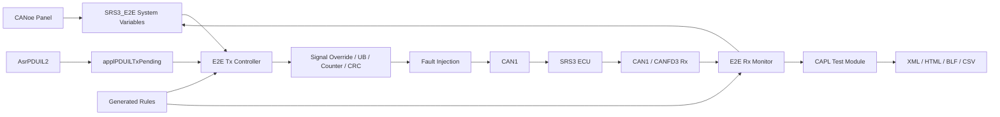
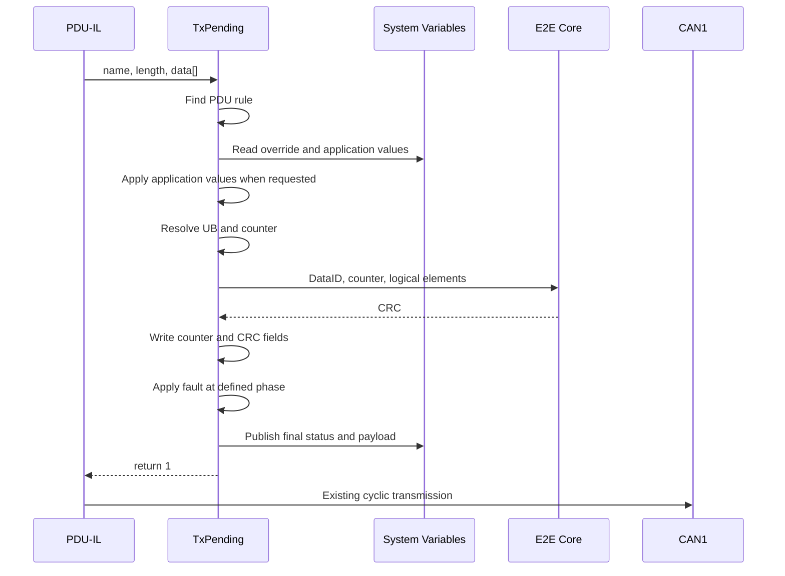

# SRS3 CANoe 12 E2E通信与测试工程设计

## 1. 文档信息

| 项目 | 内容 |
|---|---|
| 目的 | 定义CANoe 12中SRS3 E2E通信、Panel、故障注入和测试架构 |
| 基线 | GitHub `origin/main`，初始恢复提交 `e4b692a` |
| CANoe | 12.0.75 |
| ECU | GEEA3.5 SRS3真实ECU |
| 总线 | CAN1 Tx/Rx；CANFD3后续Rx |
| 日期 | 2026-08-12 |
| 当前验证级别 | 文件级静态验证；未执行CANoe编译和测量 |

## 2. 设计结论

保留当前 `AsrPDUIL2` 周期发送机制，在 `applPDUILTxPending()` 中叠加：

1. Panel应用信号覆盖；
2. UB处理；
3. Counter更新；
4. Profile G CRC计算；
5. 分阶段故障注入；
6. Panel状态发布。

正常发送不使用额外 `on timer + output()`，避免与PDU-IL重复发送。接收方向使用
独立E2E Monitor节点，自动化判定使用CAPL Test Module。

## 3. 当前基线

### 3.1 已存在

- `GEEA3.5_SRS3_CAN1_12.0.cfg`；
- `Lib/AsrPDUIL2.dll`，文件版本2.85.33.0；
- CAN1 PDU-IL Simulation Node；
- KL15/KL30控制；
- CAN1和CANFD3 DBC；
- AUTOSAR ECU Extract；
- 16个Profile G对象；
- IPDU37的TxPending只读日志钩子。

### 3.2 当前缺口

- 当前TxPending没有修改应用信号、Counter和CRC；
- 当前系统变量只有IL控制；
- 没有Panel文件；
- 没有接收E2E Checker；
- Test Setup为空；
- Logging部分路径仍指向Vector Sample目录；
- CANFD3尚未加入当前CAN1运行配置。

## 4. 架构



### 4.1 组件边界

| 组件 | 职责 | 禁止职责 |
|---|---|---|
| Panel | 输入、命令、状态显示 | CRC算法、位打包、定时发送 |
| PDU-IL | PDU生命周期和周期发送 | 项目E2E故障注入 |
| Tx Controller | 应用覆盖、Protect、故障和状态 | 新建重复周期发送器 |
| Rx Monitor | CRC/Counter/周期/超时检查 | 修改接收帧 |
| Test Module | 刺激、判定、报告 | 作为正常通信发送器 |
| Generator | ARXML/DBC到CAPL规则 | 人工猜测信号映射 |

## 5. 规则和数据源

| 信息 | 事实源 |
|---|---|
| E2E对象、DataID、MaxDelta、发送/接收角色 | ARXML |
| PDU/Frame、Update Bit映射 | Com ARXML并与DBC交叉检查 |
| CAN ID、DLC、周期、物理Start Bit | DBC |
| Factor、Offset、范围、单位、枚举 | DBC |
| 项目Profile G算法行为 | ZXDoc冻结实现和Golden Vector |
| CANoe运行规则 | 自动生成的CAPL `.cin` |

运行时不解析ARXML或JSON。所有规则在工程准备阶段生成并冻结为CAPL静态表。

`Config/E2E_Rules_Manifest.json`是当前工程的审计清单，不替代ARXML/DBC事实源。

## 6. E2E算法

项目冻结参数：

| 参数 | 值 |
|---|---|
| Profile | `PROFILE_G / P01 behavior` |
| CRC | CRC-8/SAE-J1850-ZERO |
| Polynomial | `0x1D` |
| Init/XorOut | `0x00 / 0x00` |
| Reflection | false / false |
| Counter | 0～14，模15 |
| 非法Counter | 15 |
| DataID字节顺序 | Low Byte、High Byte |

CRC逻辑输入：

```text
DataID_LSB
DataID_MSB
Counter
Application Element 1
Application Element 2
...
```

普通元素按ARXML `ApplicationRecordElement`名称不区分大小写排序。多字节逻辑元素
按Little Endian序列化；物理CAN位布局仍按DBC Motorola/Intel定义。ARXML逻辑
Offset与DBC物理Start Bit不得混用。

UB为0时该Group不推进Counter和CRC。共享PDU中的Group分别维护状态。

## 7. Tx范围

| ID | PDU | 周期 | DataID | Group | 应用元素数 |
|---|---|---:|---:|---|---:|
| `0x040` | `ZCUDZCUDCAN1SignalIPDU01` | 15 ms | `0x0036` | VehMtnSt | 1 |
| `0x050` | `ZCUDZCUDCAN1SignalIPDU47` | 10 ms | `0x0411` | PreCrashFrontData | 4 |
| `0x076` | `ZCUDZCUDCAN1SignalIPDU37` | 20 ms | `0x0037` | VehSpdLgt | 2 |
| `0x0F0` | `ZCUDZCUDCAN1SignalIPDU04` | 30 ms | `0x0074` | VehModMngtGlbSafe1 | 8 |
| `0x390` | `ZCUDZCUDCAN1SignalIPDU10` | 800 ms | `0x0474` | PassAirbLampStsRec | 1 |

详细物理字段和别名映射见 `Config/E2E_Rules_Manifest.json`。

## 8. Panel设计

Panel包含四页：

1. Communication；
2. E2E Tx；
3. Fault Injection；
4. Monitor & Test。

CANoe 12中创建5个固定应用信号GroupBox，使用 `setControlVisibility()` 切换显示，
使用 `enableControl()` 控制运行状态下的编辑权限。运行时不动态创建控件。

覆盖模式：

- Pass Through：保留PDU-IL应用数据；
- One Shot：只覆盖下一PDU周期；
- Continuous：每个周期持续覆盖；
- Restore Normal：清除覆盖和故障，下一PDU周期恢复。

每个应用元素包含Physical/Enum、Raw、Use Raw和Input Valid。CRC、Counter和UB不
作为普通应用数据编辑。

完整控件名和System Variable绑定见 `Panels/README.md`。

## 9. Tx处理顺序



所有CRC计算必须基于最终应用数据。One Shot在一次成功TxPending处理后自动回到
Pass Through。

## 10. 故障模型

| 故障 | 阶段 | 设计行为 |
|---|---|---|
| UB=0 | Protect前 | 不推进Counter和CRC |
| Freeze Counter | Counter阶段 | 重复上次Counter，可重算有效CRC |
| Counter=15 | Counter阶段 | 支持重算CRC和不重算CRC两种模式 |
| Counter Jump | Counter阶段 | 指定合法Counter并重算CRC |
| Wrong DataID | CRC阶段 | Payload不变，使用错误DataID计算CRC |
| Corrupt CRC | Protect后 | 正确CRC生成后执行XOR掩码 |
| Corrupt Payload | Protect后 | 修改应用位，不重算CRC |
| Stop Tx | 发送控制 | 抑制发送形成超时 |

5个Tx对象MaxDelta均为14，合法Counter之间的跳变通常会被解释为丢帧，因此错误
序列测试应优先采用重复Counter、Counter 15、CRC错误和超时。

## 11. Rx范围

CAN1监控10个E2E Group：

```text
0x010 CrashStsSafe
0x012 ADataRawSafe
0x013 AsyDataWithCmpSafe
0x021 BltLockStSafeAtDrvr
0x070 RecOfPostImpctBrkgSuspc
0x089 AgDataRawSafe
0x142 AgDataRaw2Safe
0x142 PassAirbLampReq
0x148 RecOfPostImpctBrkgCfmd
0x274 SRSResdSig1ToZCUDMSafety
```

CANFD3监控5个Group：`0x032`中的4个独立Group和`0x03F CrashStsSafe`。

建议Rx状态：

```text
NO_DATA → INITIAL → OK / OK_SOME_LOST / REPEATED /
WRONG_SEQUENCE / CRC_ERROR / UB_INACTIVE / TIMEOUT
```

共享帧必须按Group独立维护状态，不能只对整帧给一个Verdict。

## 12. 状态与恢复

- Measurement Start：Counter和统计清零；框架默认Disabled。
- Global Enable：只有规则和Golden Vector通过后才允许开启。
- UB=0：保持Counter。
- Restore Normal：清除覆盖和故障，保留Auto Protect。
- Node Disable：清除One Shot和Continuous。
- Measurement Stop：停止记录并关闭报告文件。

KL15循环是否重置Tx/Rx Counter、超时阈值和ECU恢复判据必须由项目需求冻结。

## 13. 测试和报告

测试覆盖：

- 规则生成和Golden Vector；
- 16个应用元素Min/Nominal/Max；
- Raw和Reserved值；
- Pass Through、One Shot、Continuous、Restore；
- Counter回卷；
- UB=0；
- CRC、Counter、DataID、Payload和Timeout故障；
- 故障恢复；
- CAN1全部Rx Group；
- CANFD3多Group；
- KL15循环；
- 报告完整性。

报告目录：

```text
Reports/{MeasurementIndex}/
  E2E_TestReport.xml
  E2E_TestReport.html
  E2E_Trace.blf
  E2E_Samples.csv
  E2E_WriteWindow.txt
  Baseline.json
```

Baseline记录Git提交、CANoe/DLL版本、ARXML/DBC哈希、规则哈希、ECU版本和测试时间。

## 14. 验收条件

- CANoe 12编译无错误；
- 原PDU-IL周期不变且无重复帧；
- 5个Tx PDU均进入统一入口；
- 16个应用元素均可通过Panel修改；
- One Shot只影响一个PDU周期；
- Counter按0～14循环；
- CRC与ZXDoc Golden Vector一致；
- Restore Normal在下一PDU周期恢复；
- 15个Rx Group独立判定；
- 故障注入只改变目标错误维度；
- 报告可追溯到源码和数据库版本。

## 15. 风险和待决策项

1. `E2E_CAN1.arxml`与原ARXML的运行选择需在CANoe中确认；不能仅因文件名切换。
2. 当前CFG内嵌System Variable与外部XML需要建立一致性检查。
3. Stop Tx的PDU级抑制API需通过CANoe 12帮助或最小实验确认。
4. CANFD3仲裁/数据相位、BRS和通道映射尚未进入当前配置。
5. ECU E2E错误反应的可观测接口尚未冻结。
6. KL15和Measurement重启后的Counter初始化策略尚未冻结。
7. 当前Logging路径需要迁移到工程内Reports目录。

## 16. 证据索引

| 证据 | 路径 |
|---|---|
| TxPending当前钩子 | `Nodes/VectorSimulationNode.can` |
| PDU-IL/KL15控制 | `CAPL/PDU-IL-KL15-Helper_CAN1.cin` |
| E2E ARXML | `Databases/SDB325300_SRS3_AR-4.2.2_251215_UnFlattened.arxml` |
| CAN1物理映射 | `Databases/CAN1/*.dbc` |
| CANFD3物理映射 | `Databases/CANFD3/*.dbc` |
| 审计规则 | `Config/E2E_Rules_Manifest.json` |
| 静态检查 | `Tools/verify_e2e_framework.py` |
| Golden Vector | `Test/GoldenVectors.json` |
| Golden Vector独立校验 | `Tools/verify_e2e_golden_vectors.py` |
| 测试目录 | `Test/E2E_Test_Catalog.csv` |
