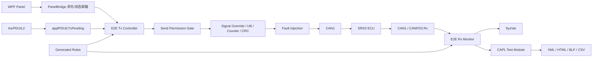
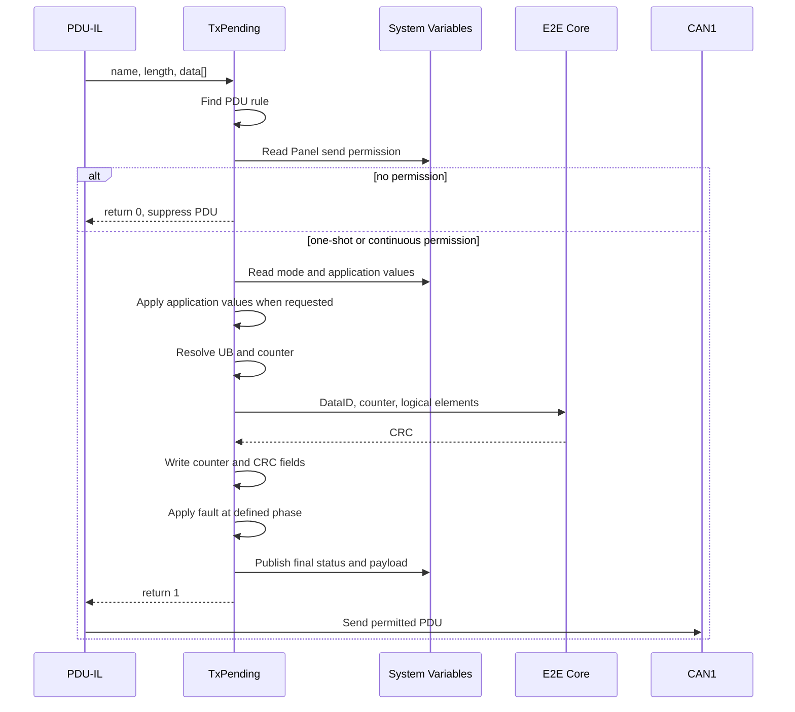

# SRS3 CANoe 12 E2E通信与测试工程设计

## 1. 文档信息

| 项目 | 内容 |
|---|---|
| 目的 | 定义CANoe 12中SRS3 E2E通信、Panel、故障注入和测试架构 |
| 基线 | GitHub `origin/main`，初始恢复提交 `e4b692a` |
| CANoe | 12.0.75 |
| ECU | GEEA3.5 SRS3真实ECU |
| 总线 | 单工程：CAN1 Tx/Rx；CANFD3后续Rx |
| 日期 | 2026-08-12 |
| 当前验证级别 | 静态规则/Golden Vector通过；用户截图已验证0x076连续发送，其他帧待动态验收 |

## 2. 设计结论

保留 `AsrPDUIL2` 作为唯一PDU发送路径，但5个受保护PDU默认不允许上总线。PDU-IL仍按数据库周期产生TxPending机会，`applPDUILTxPending()` 根据Panel许可返回0或1，并在放行前完成：

1. Panel应用信号覆盖；
2. UB处理；
3. Counter更新；
4. Profile G CRC计算；
5. 分阶段故障注入；
6. Panel状态发布；
7. 单帧/连续发送许可判定。

未勾选发送使能或未执行发送时，回调对5个目标PDU返回0。单帧模式只放行下一次所选PDU调度；连续模式才按数据库周期持续放行。工程不使用额外 `on timer + output()`，避免第二发送源。接收方向使用
独立E2E Monitor节点，自动化判定使用CAPL Test Module。

## 3. 当前基线

### 3.1 已存在

- `GEEA3.5_SRS3_CAN1_12.0.cfg`；
- `Lib/AsrPDUIL2.dll`，文件版本2.85.33.0；
- CAN1 PDU-IL Simulation Node；
- KL15/KL30控制；
- CAN1和CANFD3 DBC；
- AUTOSAR ECU Extract；
- 16个Profile G对象；
- IPDU37的TxPending只读日志钩子。

### 3.2 当前缺口

- 当前TxPending没有修改应用信号、Counter和CRC；
- 当前系统变量只有IL控制；
- 没有Panel文件；
- 没有接收E2E Checker；
- Test Setup为空；
- Logging部分路径仍指向Vector Sample目录；
- CANFD3尚未加入当前CAN1运行配置。

## 4. 架构



### 4.1 组件边界

| 组件 | 职责 | 禁止职责 |
|---|---|---|
| Panel | 输入、发送许可命令、状态显示 | CRC算法、位打包、直接发送 |
| PanelBridge | WPF与CAPL间交换命令和状态 | 产生周期、发送PDU、计算E2E |
| PDU-IL | 产生数据库调度机会并执行最终PDU发送 | 决定Panel测试意图 |
| Tx Controller | 默认拦截、单帧/连续许可、应用覆盖、Protect、故障和状态 | 新建重复发送器 |
| Rx Monitor | CRC/Counter/周期/超时检查 | 修改接收帧 |
| Test Module | 刺激、判定、报告 | 作为正常通信发送器 |
| Generator | ARXML/DBC到CAPL规则 | 人工猜测信号映射 |

## 5. 规则和数据源

| 信息 | 事实源 |
|---|---|
| E2E对象、DataID、MaxDelta、发送/接收角色 | ARXML |
| PDU/Frame、Update Bit映射 | Com ARXML并与DBC交叉检查 |
| CAN ID、DLC、周期、物理Start Bit | DBC |
| Factor、Offset、范围、单位、枚举 | DBC |
| 项目Profile G算法行为 | ZXDoc冻结实现和Golden Vector |
| CANoe运行规则 | 自动生成的CAPL `.cin` |

运行时不解析ARXML或JSON。所有规则在工程准备阶段生成并冻结为CAPL静态表。

`Config/E2E_Rules_Manifest.json`是当前工程的审计清单，不替代ARXML/DBC事实源。

## 6. E2E算法

项目冻结参数：

| 参数 | 值 |
|---|---|
| Profile | `PROFILE_G / P01 behavior` |
| CRC | CRC-8/SAE-J1850-ZERO |
| Polynomial | `0x1D` |
| Init/XorOut | `0x00 / 0x00` |
| Reflection | false / false |
| Counter | 0～14，模15 |
| 非法Counter | 15 |
| DataID字节顺序 | Low Byte、High Byte |

CRC逻辑输入：

```text
DataID_LSB
DataID_MSB
Counter
Application Element 1
Application Element 2
...
```

普通元素按ARXML `ApplicationRecordElement`名称不区分大小写排序。多字节逻辑元素
按Little Endian序列化；物理CAN位布局仍按DBC Motorola/Intel定义。ARXML逻辑
Offset与DBC物理Start Bit不得混用。

UB为0时该Group不推进Counter和CRC。共享PDU中的Group分别维护状态。

## 7. Tx范围

| ID | PDU | 周期 | DataID | Group | 应用元素数 |
|---|---|---:|---:|---|---:|
| `0x040` | `ZCUDZCUDCAN1SignalIPDU01` | 15 ms | `0x0036` | VehMtnSt | 1 |
| `0x050` | `ZCUDZCUDCAN1SignalIPDU47` | 10 ms | `0x0411` | PreCrashFrontData | 4 |
| `0x076` | `ZCUDZCUDCAN1SignalIPDU37` | 20 ms | `0x0037` | VehSpdLgt | 2 |
| `0x0F0` | `ZCUDZCUDCAN1SignalIPDU04` | 30 ms | `0x0074` | VehModMngtGlbSafe1 | 8 |
| `0x390` | `ZCUDZCUDCAN1SignalIPDU10` | 800 ms | `0x0474` | PassAirbLampStsRec | 1 |

详细物理字段和别名映射见 `Config/E2E_Rules_Manifest.json`。

## 8. Panel设计

### 8.1 当前WPF实现（v1.4.0）

当前实施采用单页WPF上下表格布局，保留下述逻辑模型，但不再使用五套固定GroupBox作为主操作界面。WPF只绑定一个 `Int32[64]` 邮箱：`SRS3_E2E::WpfBridge::PanelBridge`。

CANoe可能在控件初始化时先报告 `ExchangeSymbolDataType.Unknown`，测量数据激活后才报告 `LongArray`。`Unknown`只表示等待数据类型激活，不表示Symbol未绑定；插件通过ValueChanged事件和250 ms只读轮询完成状态迁移。

发送使能使用确认式握手：Panel把请求值写入索引5并把Command索引6置3；CAPL在下一次PDU-IL TxPending中更新实际 `SRS3_E2E::Control::GlobalEnable`，清除Command并回写索引5。使能只解锁发送命令，本身不发送PDU。只有LongArray有效、BridgeReady=1且实际使能=1时，执行当前才可用；停止当前和停止全部在BridgeReady=1时可用。

PDU-IL仍是唯一底层发送路径，但CAPL是发送许可门：无许可返回0，单帧/连续有许可时完成保护并返回1。Trace同时显示同一事件的 `CAN Frame Tx` 与 `AUTOSAR PDU Tx` 不是重复发送。

当前交付只实现一个E2E Tx WPF控件，不再采用旧方案中的四页Panel和5套固定GroupBox。控件从上到下固定为：命令工具栏、5个受保护PDU表、E2E只读状态、当前PDU应用信号表、完整8-byte最终Payload。PDU切换通过同一个信号表的数据源完成，不在运行时创建Vector标准控件。

视觉遵循PDU Interactive Generator的上下表格层级：白/浅灰为主体，低饱和蓝色表示主操作和Counter，黄色表示UB或等待，红色表示CRC/故障，绿色只表示桥接安全使能。顶部纯黑标题栏已取消。

覆盖模式：

- 原值单帧 / Pass Through：不覆盖应用值，只放行下一次所选PDU调度；
- 改值单帧 / One Shot：覆盖应用值并只放行一次；
- 改值连续 / Continuous：覆盖应用值，并按数据库周期持续放行；
- 停止当前：撤销所选PDU的单帧或连续许可，其他PDU保持原状态；停止全部撤销所有许可。

`发送使能`是Panel发送命令的安全锁；Measurement启动和停止都强制清零。`自动保护`对所有Panel发送统一生效：勾选后写入UB/Counter/CRC，不勾选则发送未经本控制器保护的最终Payload，用于负向测试。

每个应用元素包含Physical/Enum、Raw、Use Raw和Input Valid。CRC、Counter和UB不
作为普通应用数据编辑。

完整桥接字段、控件行为和CANoe动态验收步骤见 `PanelPlugin/README.md` 与 `Docs/Panel_Function_Verification.md`。

## 9. Tx处理顺序



所有CRC计算必须基于最终应用数据。One Shot在一次成功TxPending处理后自动撤销该PDU许可；Continuous保持该PDU许可直到停止当前、停止全部、取消发送使能或Measurement结束。

Tx Panel采用每PDU独立运行模型：所选PDU变化只切换编辑和状态归属，不改变其他PDU许可。执行当前时，只为所选PDU更新发送模式、UB模式、自动保护、应用Raw和许可；停止当前只撤销该PDU，停止全部撤销5个PDU。由此既支持单ID发送，也支持任意多个ID按各自数据库周期并行发送。

并行发送不增加第二发送源：每个ID仍只在自己的PDU-IL TxPending机会中放行。多个周期在同一时间到期时，由CAN控制器按ID仲裁和现有总线负载决定实际发送时刻，因此验收应检查平均周期及合理抖动，不能要求所有帧时间戳完全等于标称周期。

### 9.1 单工程CAN1/CANFD3与Panel分层

一个CANoe `.cfg` 可以同时承载CAN1和CANFD3，但“网络选择”是对象筛选和路由选择，不是把同一个PDU改发到另一条总线。当前事实边界如下：

| 网络 | 当前规则角色 | 当前运行配置 | Panel行为 |
|---|---|---|---|
| CAN1 | 5个Tx PDU；10个后续Rx Group | 已装载CAN1数据库与PDU-IL节点 | Tx控件可发送；后续Rx控件可监控 |
| CANFD3 | 5个Rx Group，帧 `0x032/0x03F` 的DBC发送节点为SRS3 | DBC文件存在，但尚未加入当前CFG | 仅在完成通道配置后由Rx控件选择/监控，不提供Tx按钮 |

单工程最终Panel建议采用同一视觉体系下的四个独立WPF控件/页面，避免扩大当前已验证的Tx邮箱协议：

| Panel | 网络选择 | 核心布局 | 命令边界 |
|---|---|---|---|
| E2E Tx Control | 固定CAN1 Tx | PDU表/各ID状态 → 信号表 → 8-byte Raw/CRC/Counter/UB | 执行当前/停止当前/停止全部/发送使能 |
| E2E Rx Monitor | CAN1 / CANFD3 | 网络与Group表 → 当前Group状态/时序 → 接收Raw | 全部只读，可清统计 |
| Fault Injection | CAN1 Tx | PDU/故障/参数表 → 生效阶段 → 当前注入状态 | Arm/Apply Once/Continuous/Clear |
| Test Runner | CAN1 / CANFD3 | 用例树 → 步骤与期望 → Pass/Fail/证据路径 | Run/Stop/Export，不直接作为第二发送器 |

Rx控件的网络下拉框只有在对应CAPL Rx节点报告Ready后才可选择实时模式；否则显示“数据库存在/通道未配置”，不显示伪造状态。各控件使用独立System Variable邮箱（保留当前 `PanelBridge` 给Tx），从而不破坏已导入的Tx绑定，也便于单独编译和回退。

## 10. 故障模型

| 故障 | 阶段 | 设计行为 |
|---|---|---|
| UB=0 | Protect前 | 不推进Counter和CRC |
| Freeze Counter | Counter阶段 | 重复上次Counter，可重算有效CRC |
| Counter=15 | Counter阶段 | 支持重算CRC和不重算CRC两种模式 |
| Counter Jump | Counter阶段 | 指定合法Counter并重算CRC |
| Wrong DataID | CRC阶段 | Payload不变，使用错误DataID计算CRC |
| Corrupt CRC | Protect后 | 正确CRC生成后执行XOR掩码 |
| Corrupt Payload | Protect后 | 修改应用位，不重算CRC |
| Stop Tx | 发送控制 | 抑制发送形成超时 |

5个Tx对象MaxDelta均为14，合法Counter之间的跳变通常会被解释为丢帧，因此错误
序列测试应优先采用重复Counter、Counter 15、CRC错误和超时。

## 11. Rx范围

CAN1监控10个E2E Group：

```text
0x010 CrashStsSafe
0x012 ADataRawSafe
0x013 AsyDataWithCmpSafe
0x021 BltLockStSafeAtDrvr
0x070 RecOfPostImpctBrkgSuspc
0x089 AgDataRawSafe
0x142 AgDataRaw2Safe
0x142 PassAirbLampReq
0x148 RecOfPostImpctBrkgCfmd
0x274 SRSResdSig1ToZCUDMSafety
```

CANFD3监控5个Group：`0x032`中的4个独立Group和`0x03F CrashStsSafe`。

建议Rx状态：

```text
NO_DATA → INITIAL → OK / OK_SOME_LOST / REPEATED /
WRONG_SEQUENCE / CRC_ERROR / UB_INACTIVE / TIMEOUT
```

共享帧必须按Group独立维护状态，不能只对整帧给一个Verdict。

## 12. 状态与恢复

- Measurement Start：Counter、命令、发送许可和发送使能全部清零；5个PDU默认不发送。
- 发送使能：只解锁Panel命令，不自动发送。
- UB=0：保持Counter。
- 停止当前：清除所选PDU发送许可和覆盖；停止全部清除全部PDU许可和覆盖。
- Node Disable：清除One Shot和Continuous。
- Measurement Stop：停止记录并关闭报告文件。

KL15循环是否重置Tx/Rx Counter、超时阈值和ECU恢复判据必须由项目需求冻结。

## 13. 测试和报告

测试覆盖：

- 规则生成和Golden Vector；
- 16个应用元素Min/Nominal/Max；
- Raw和Reserved值；
- 原值单帧、改值单帧、改值连续、停止发送；
- Counter回卷；
- UB=0；
- CRC、Counter、DataID、Payload和Timeout故障；
- 故障恢复；
- CAN1全部Rx Group；
- CANFD3多Group；
- KL15循环；
- 报告完整性。

报告目录：

```text
Reports/{MeasurementIndex}/
  E2E_TestReport.xml
  E2E_TestReport.html
  E2E_Trace.blf
  E2E_Samples.csv
  E2E_WriteWindow.txt
  Baseline.json
```

Baseline记录Git提交、CANoe/DLL版本、ARXML/DBC哈希、规则哈希、ECU版本和测试时间。

## 14. 验收条件

- CANoe 12编译无错误；
- 未执行Panel发送时5个目标PDU在总线上为零帧；
- 连续模式周期与数据库周期一致且无重复帧；
- 5个Tx PDU均进入统一入口；
- 16个应用元素均可通过Panel修改；
- One Shot只影响一个PDU周期；
- Counter按0～14循环；
- CRC与ZXDoc Golden Vector一致；
- 停止发送后所选PDU后续调度全部被抑制；
- 15个Rx Group独立判定；
- 故障注入只改变目标错误维度；
- 报告可追溯到源码和数据库版本。

## 15. 风险和待决策项

1. `E2E_CAN1.arxml`与原ARXML的运行选择需在CANoe中确认；不能仅因文件名切换。
2. 当前CFG内嵌System Variable与外部XML需要建立一致性检查。
3. PDU级抑制使用CANoe 12官方 `applPDUILTxPending()` 返回0；仍需在CANoe编译和Trace中完成动态验收。
4. CANFD3仲裁/数据相位、BRS和通道映射尚未进入当前配置。
5. ECU E2E错误反应的可观测接口尚未冻结。
6. KL15和Measurement重启后的Counter初始化策略尚未冻结。
7. 当前Logging路径需要迁移到工程内Reports目录。

## 16. 证据索引

| 证据 | 路径 |
|---|---|
| TxPending当前钩子 | `Nodes/VectorSimulationNode.can` |
| PDU-IL/KL15控制 | `CAPL/PDU-IL-KL15-Helper_CAN1.cin` |
| E2E ARXML | `Databases/SDB325300_SRS3_AR-4.2.2_251215_UnFlattened.arxml` |
| CAN1物理映射 | `Databases/CAN1/*.dbc` |
| CANFD3物理映射 | `Databases/CANFD3/*.dbc` |
| 审计规则 | `Config/E2E_Rules_Manifest.json` |
| 静态检查 | `Tools/verify_e2e_framework.py` |
| Golden Vector | `Test/GoldenVectors.json` |
| Golden Vector独立校验 | `Tools/verify_e2e_golden_vectors.py` |
| 测试目录 | `Test/E2E_Test_Catalog.csv` |
